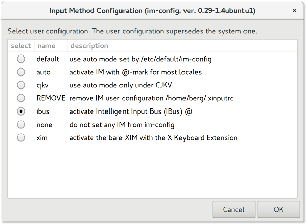
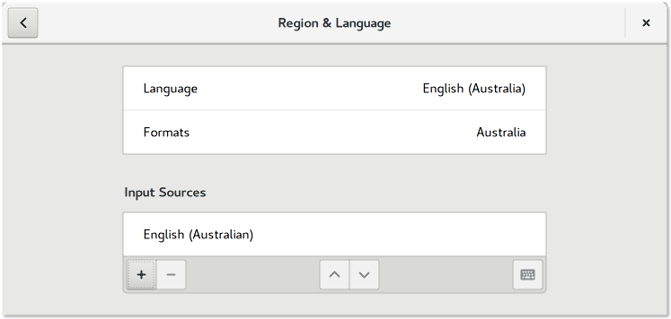
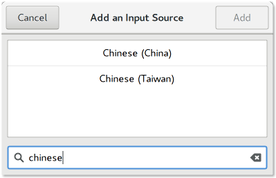
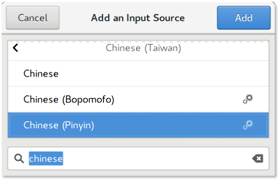

# chinese pinyin input method keyboard on gnome
<sup>os targets: ubuntu (*17.10*), ubuntu gnome (*17.04, 16.10, 16.04*), debian (*?*), fedora (*?*)
<br />

installing chinese pinyin for engish speakers on gnome shell **should** be simple, don't be coersed by `fcitx`.

## follow the steps
1. ensure `im-config` is set to `ibus`:
    ```
    berglh@ubuntu:~$ im-config
    ```
    

2. install `ibus-pinyin` package:
    ```
    # ubuntu gnome 17.04
    berglh@ubuntu:~$ sudo apt-get install ibus-pinyin
    ```

3. install the pinyin `input source`
    1. open `region & language` in the `gnome control centre`
    2. click the `+` symbol in `input sources`
        
    3. click the vertical dots and type `chinese` and select `china` or `taiwan`
        
    4. click `chinese (pinyin)` and click `add`
        <br /><sup>**tip**: `bopomofo` option</sup><br />
        
