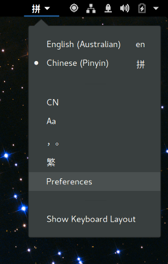
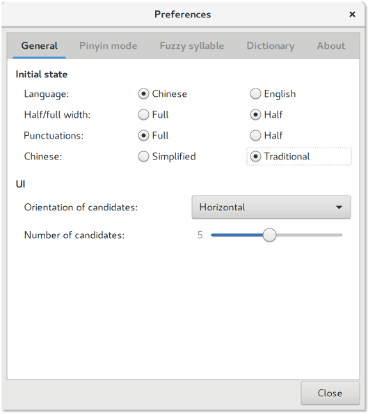

## gnome chinese pinyin input method keyboard

installing chinese pinyin for engish speakers on gnome shell **should** be simple, don't be coersed by **fcitx** although it does work, sometimes.

### targets

os | versions
:---|:---
ubuntu | *17.10*
ubuntu gnome | *17.04, 16.10, 16.04*
debian | *?*
fedora | *?*

### steps
1. install the *appropriate* **locales**
    <br /><sup>**note**: not sure if this is required</sup><br />
    ```
    berglh@ubuntu:~$ sudo dpkg-reconfigure locales
    ```
    - select **zh_CN.UTF-8** for china
    - select **zh_TW.UTF-8** for taiwan
    <br /><sup>**tip**: live a littele, select both</sup><br />

2. ensure **im-config** is set to **ibus**:
    ```
    berglh@ubuntu:~$ im-config
    ```
    <br />

3. install **ibus-pinyin** package:
    ```
    # ubuntu gnome 17.04
    berglh@ubuntu:~$ sudo apt-get install ibus-pinyin
    ```

4. install the pinyin **input source**
    - open region & language in the gnome control centre
    - click the `+` symbol in `input sources`
        
    - click the dots, type `chinese` and select input
        
    - click `chinese (pinyin)` and click `add`
        <br /><sup>**tip**: `bopomofo` option</sup><br />
        <br />

5. configure **input method** settings
    
    - for example, select simplified or traditional
        <br />

6. use **super+space** to toggle inputs

